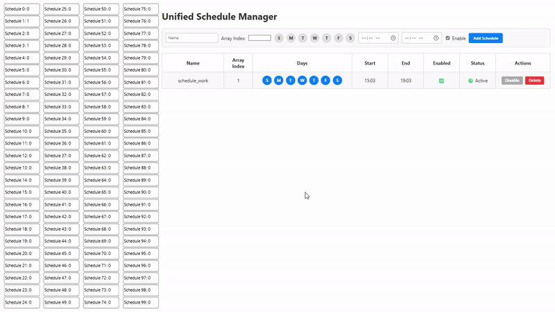

# Unified Schedule Manager

A software running as a `windows service` that host a web server on **`https://localhost:3131`** that allow the user to create `schedules` based on `day of week` and `time of day` and execute an OpenPipe script that writes to some variables in the locally running `WinCC Unified PC RT` application if the each schedule is currently `true` or `false`.

I also provide in this example how we can leverage the npm module [node-windows](https://www.npmjs.com/package/node-windows) to run a JavaScript file "as a service" in a Windows environment.

## Installation Steps

1. **Download** the file package `USM_V1.1.0.zip` from the `Releases` section on the right.
2. **Unzip** the files to any location on the WinCC Unified PC RT station.
3. **Run** the `/src/Install_RunAsAdmin.bat` file as **administrator**.
   - If you want to change default port of _`3131`_ change the `const PORT = 3131` inside **app.js** to whatever port you want to use.

## Uninstallation step

1. **Run** the `/src/Uninstall_RunAsAdmin` file as **administrator** to uninstall the service.
   \*Will delete the service even if it's currently running.

## Steps in TIA Portal

1. **Download** the file `UnifiedScheduleManager.zal20` from this repository and open it in the **Global libraries** (compressed) area of TIA Portal.

### **_The library_** provided contains:

1. **Master copies** that contain:
   - Example tag table `UnifiedScheduleManager` the array tag **`_SCHEDMAN_[0..99]`**
     -- You can define the array size to your need, it doesn't matter.
   - Example of usage (`ExampleScreen`).

### **_Engineering_** a project:

1. Simply create one internal tag named:
   - `_SCHEDMAN_` of datatype **Array of [0..x] Bool** (maximum of 2000 (0..1999) elements for arrays in WinCC Unified!)
2. Navigate at `https://localhost:3131` either with WinCC Web Control object or with your own web browser and create your schedules.
   - The field `Array Index` that you need to provide when creating a schedule is associated to the array index of your HMI Tag `_SCHEDMAN_`

### **_Re-creating certificates_**:

I've created a Self Signed certificate using [_OpenSSL_](https://slproweb.com/products/Win32OpenSSL.html) with a validity of **10 years** (expires on: Thursday, May 10, 2035 at 3:40:06 PM) and I know 10 years might be a bad thing for cyber security, but you can create you own certificate with installing OpenSSL 3.5 for Windows, then:

1. Open a _CMD Prompt_ as **Administrator**
2. Navigate to the installation directory, eg: **`cd C:\Program Files\OpenSSL-Win64\bin`**
3. Run the following command:
   **`openssl req -x509 -newkey rsa:2048 -nodes -keyout key.pem -out cert.pem -days 365`** - This will create a 365 day valid certificate in `C:\Program Files\OpenSSL-Win64\bin`, as a **cert.pem** and **key.pem**, that should be **placed in the Unified Schedule Manager folder, alongside the app.js**. - If you change the name of the .pem's, make sure you change also in the app.js file. - If the service was installed, you can uninstall it and install it again, you will keep the schedule as the schedules.db file already exist.

   - _Make sure to do your due diligence for cyber risk with certificates, I'm not a cryptography expert._

## Tested scope

This has only be tested with `WinCC Unified PC RT V20`.

# Disclaimer:

> The examples are non-committal and do not lay any claim to completeness with regard to configuration and equipment as well as any eventualities. The examples do not represent any custom-designed solutions but shall offer only support at typical tasks. You are accountable for the proper mode of the described products yourself.
>
> These examples do not discharge you from the obligation to safe dealing for application, installation, business and maintenance. By use of these examples, you appreciate that Siemens cannot be made liable for possible damages beyond the provisions regarding described above. We reserve us the right to carry out changes at these examples without announcement at any time. The contents of the other documentation have priority at deviations between the suggestions in these examples and other Siemens publications, such as catalogues and manuals.
>
> > Use at your own risk.
